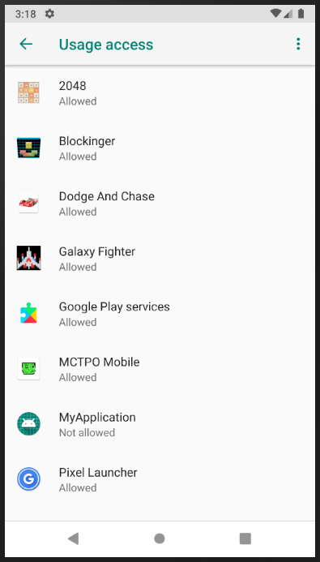
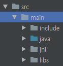

[](https://zenodo.org/badge/latestdoi/197481937)
# tzMon
The TZMon is the security framework for a mobile game application.

This framework is specially designed for an integrity check, secure update, abusing detection, data hiding, and timer synchronization using **ARM TrustZone**.

TZMon uses [AOSP](https://optee.readthedocs.io/building/aosp/aosp.html)(Android Open Source Project) as a Normal OS and [OPTEE](https://optee.readthedocs.io/index.html) as a Secure OS.

Target Board is **hikey960**. Refer to the link for more information. [[here](https://www.96boards.org/product/hikey960/)]

There are two modes for TZMon; **SIM_MODE**, and **TARGET_MODE**.

A TARGET_MODE use hikey960 board as a mobile environment. SIM_MODE can make applying and verifying TZMon easy.

The simulation environments are as like below:
- Mobile Game Apps (including TZMon library): Android Studio Simulator
- TZMon Trusted Application: hikey960 board
- S2B (for connection with the simulator and the target board): Linux machine (independent of kernel version and linux distro)
- Update Server (for secure update protocol): Linux machine (independent of kernel version and linux distro)

## Getting Started with tzMon
### Prerequisites
- Preparing for the mobile game source code.
- Applying the [JNI](https://developer.android.com/ndk/samples/sample_hellojni.html) environment to the game.
- Adding permission option to the AndroidManifest.xml file.
```
  <uses-permission android:name="android.permission.PACKAGE_USAGE_STATS" tools:ignore="ProtectedPermissions" />
  <uses-permission android:name="android.permission.INTERNET" />
```
- Allowing usage access in the smart-phone or simulator.

> </img>
- Execution [update_server](https://github.com/kppw99/tzMon/tree/master/update_server/host) and [S2B](https://github.com/kppw99/tzMon/tree/master/simulation/s2b_server). (for SIM_MODE): update_server and s2b are running on linux machine. Two application must use same port number
```
  ./update_server [port_number]
  ./s2b_server [port_number]
```
- Installation of [TZMon TA](https://github.com/kppw99/tzMon/tree/master/tzmon/ta/) to the target board. Refer to the more information. [[here](https://optee.readthedocs.io/building/trusted_applications.html)]
- Installation of [TZMon Host(CA)](https://github.com/kppw99/tzMon/tree/master/tzmon/host/) for SIM_MODE

### Usage
1. Loading the TZMon library formed as JNI.
```
  static {
    System.loadLibrary("tzMonJNI");
  }
```
2. Declaration of TZMon API to the game source and compile game source.
```
  public native boolean tzmonInitKeyNFlag();
  public native boolean tzmonCheckAppHash();
  public native boolean tzmonSecureUpdate();
  public native boolean tzmonAbusingDetection();
  public native boolean tzmonSyncTimer();
  public native boolean tzmonHidingSetup();
  public native int tzmonGetHKey(String data);
```
3. Create **app/src/main/include** directory and copy **openssl** and **optee** directories.
4. Create **app/src/main/libs and jni** directory.
5. Create **app/src/main/jni/armeabi-v7a and x86** and copy **libcrypto.a, libssl.a libteec.a** files.

> </img>

6. Compile mobile game. (ctrl + F9)
7. Execution of javac to create JNI header file. (If success, it creates header file in jni directiry)
8. Create **Android.mk** file
```
# Android.mk
LOCAL_PATH := $(call my-dir)

include $(CLEAR_VARS)
LOCAL_MODULE := ssl
LOCAL_SRC_FILES := $(TARGET_ARCH_ABI)/libssl.a
LOCAL_EXPORT_C_INCLUDES := include
include $(PREBUILT_STATIC_LIBRARY)

include $(CLEAR_VARS)
LOCAL_MODULE := crypto
LOCAL_SRC_FILES := $(TARGET_ARCH_ABI)/libcrypto.a
LOCAL_EXPORT_C_INCLUDES := jni/include
include $(PREBUILT_STATIC_LIBRARY)

include $(CLEAR_VARS)
LOCAL_MODULE := teec
LOCAL_SRC_FILES := $(TARGET_ARCH_ABI)/libteec.a
LOCAL_EXPORT_C_INCLUDES := jni/include
include $(PREBUILT_STATIC_LIBRARY)

include $(CLEAR_VARS)
LOCAL_MODULE := tzMonJNI
LOCAL_SRC_FILES := tzmonMain.cpp
LOCAL_SRC_FILES += tzmonCrypto.cpp
LOCAL_SRC_FILES += tzmonSocket.cpp
LOCAL_SRC_FILES += tzmonUtil.cpp
LOCAL_SRC_FILES += tzmonTEEC.cpp
LOCAL_CFLAGS := -DSIM_MODE
LOCAL_CFLAGS += -DUSE_FIXAPPHASH
LOCAL_LDLIBS := -llog
LOCAL_LDLIBS += -ldl
LOCAL_C_INCLUDES := $(LOCAL_PATH)/include
LOCAL_STATIC_LIBRARIES += ssl
LOCAL_STATIC_LIBRARIES += crypto
LOCAL_STATIC_LIBRARIES += teec
include $(BUILD_SHARED_LIBRARY)
```
9. Copy **TZMon library** source code in the jni directory. Refer to the [link](https://github.com/kppw99/tzMon/tree/master/mobileGame/Blockinger/app/src/main/jni)

## Publications
```
Jeon, S., & Kim, H. K. (2021). TZMon: Improving mobile game security with ARM trustzone. Computers & Security, 102391.

@article{jeon2021tzmon,
  title={TZMon: Improving mobile game security with ARM trustzone},
  author={Jeon, Sanghoon and Kim, Huy Kang},
  journal={Computers \& Security},
  pages={102391},
  year={2021},
  publisher={Elsevier}
}
```

## About
This program is authored and maintained by **Sanghoon Jeon**.
> Email: kppw99@gmail.com

> GitHub[@kppw99](https://github.com/kppw99/tzMon)

